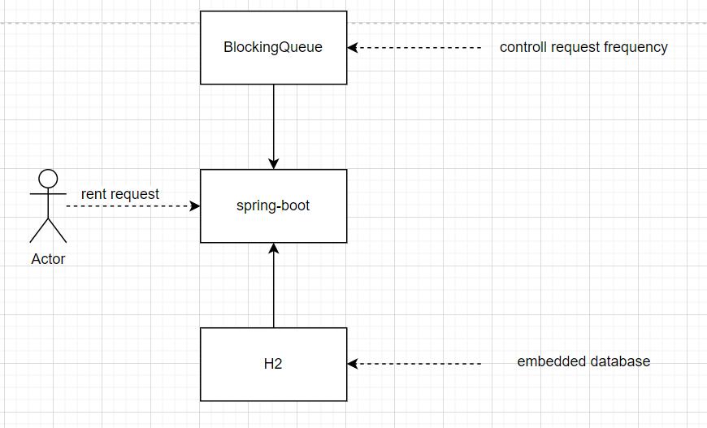

# Design Specifications

## tech stack
    1. spring-boot
    2. h2 database(optimisic lock)
    
## Rest API
    1. POST /cars/rent          // rent car
        request_body: 
        {
          "username": "",  
          "reserveSeconds": "", // INT: car reserved time in seconds 
          "model": "" //  INT: car model.
        } 
    2. POST /cars/rent/records/{id}     // return car
        path_variable:
            id: rent id, specific id for one reservation.
    
    3. GET /cars      // get all car resources
    4. GET /cars/rent/records  // get all rent events
    5. (Optional) POST /cars/rent/records/{id} // since the car cannot be returned automatically, this API is neccessary.
    
## Diagram

#### note
1. using BlockingQueue as a method for control frequency.
2. using h2 as database, init file is in resources and load when application start.
3. to simplify the problem, neglect for parameter check, and log.
4. using optimistic lock for update database stock.

## Running Environment
1. front_view:  http://20.205.136.28/
2. h2_database: http://20.205.136.28:8080/h2/ (to change the database)
        